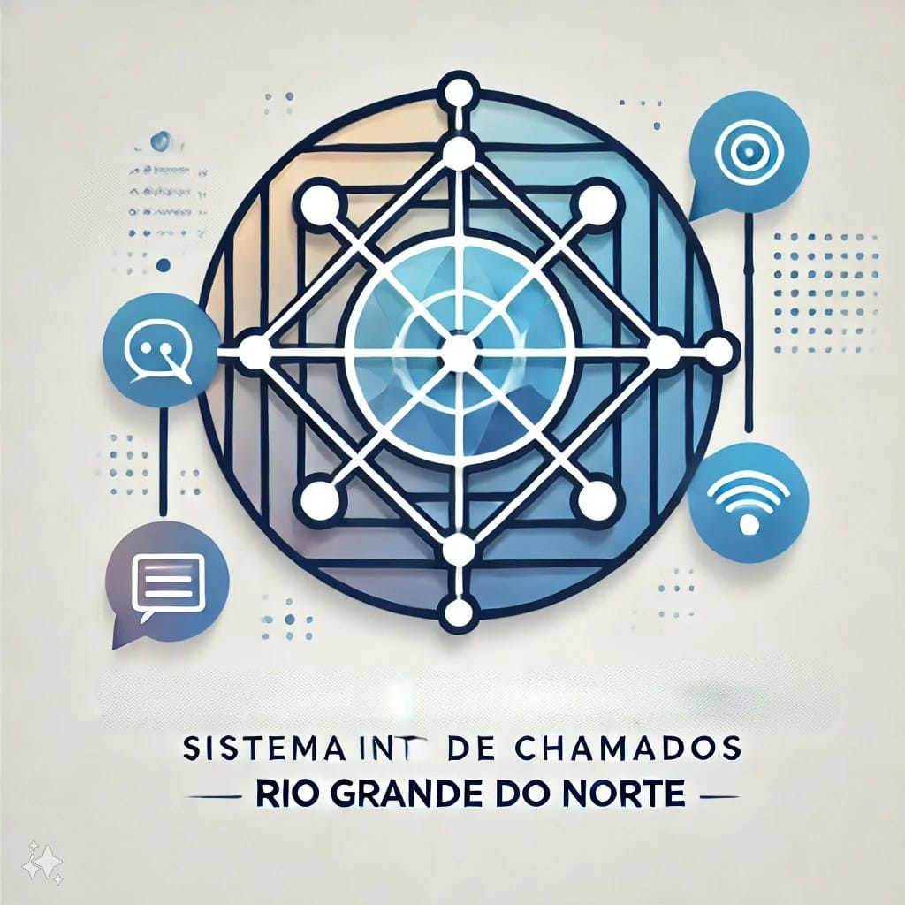

## Sistema de Chamados Interno 

Repositório dedicado ao desenvolvimento do sistema de chamados interno da [CONTROL - Controladoria Geral do Estado do Rio Grande do Norte](http://www.control.rn.gov.br/).

## Equipe de Desenvolvimento

- [Alice Lima](https://github.com/alicelimas)
- [Luiz Eduardo Kramer](https://github.com/DuduKramer)
- [Silas Eduardo Rodrigues dos Santos](https://github.com/Silas-ER)

### Coordenadores
- Marcio

### Contribuições
  ...

## Sobre o projeto

O Sistema de Chamados Interno do Estado do RN é coordenado pela Secretaria de Tecnologia da Informação e tem como objetivo proporcionar uma gestão eficiente e centralizada dos chamados técnicos e administrativos dentro das diversas secretarias e órgãos do governo. Integrado ao servidor LDAP do estado, o sistema permite que os servidores realizem login utilizando suas credenciais da rede interna, garantindo maior segurança e controle de acesso.
 
O sistema facilita a abertura, acompanhamento e resolução de chamados, promovendo a comunicação entre os setores e possibilitando um suporte técnico ágil e eficaz. Além disso, oferece funcionalidades como a categorização de chamados, histórico de atendimentos, relatórios de desempenho e indicadores de tempo de resposta.
 
Com essa ferramenta, o governo do RN visa aumentar a eficiência na solução de problemas internos e assegurar a continuidade dos serviços públicos, melhorando a transparência e a qualidade do atendimento aos servidores estaduais.

## Tecnologia Utilizada
 

## About Django

Django é um framework web de alto nível que incentiva o desenvolvimento rápido e o design limpo e pragmático. Criado por desenvolvedores experientes, Django cuida de grande parte da complexidade do desenvolvimento web, para que você possa se concentrar em escrever sua aplicação.
  
Django facilita a implementação de tarefas comuns em projetos web, como:

- [Sistema de roteamento simples e flexível;](https://docs.djangoproject.com/en/5.1/).
- [ORM (Object-Relational Mapper) poderoso e intuitivo;](https://docs.djangoproject.com/en/5.1/).
- [Suporte a múltiplos bancos de dados e migrações de esquema automáticas;](https://docs.djangoproject.com/en/5.1/).
- [Sistema de autenticação robusto;](https://docs.djangoproject.com/en/5.1/).
- [Suporte integrado para templates, formulários e validação de dados;](https://docs.djangoproject.com/en/5.1/).
- [Segurança integrada com proteção contra ataques comuns, como CSRF, XSS e SQL Injection;](https://docs.djangoproject.com/en/5.1/).
- [Admin automático e personalizável para gerenciamento de dados;](https://docs.djangoproject.com/en/5.1/).

Django é acessível, poderoso e oferece todas as ferramentas necessárias para a construção de grandes e robustas aplicações web.

## Learning Django

O Django possui uma documentação extensa e completa, facilitando o aprendizado para desenvolvedores de todos os níveis. Além da documentação oficial, há uma grande variedade de tutoriais e guias disponíveis para ajudar a dominar o framework.

## Contributing

Obrigado por considerar contribuir para o framework Django! O guia de contribuição pode ser encontrado na [documentação oficial do Django]([https://laravel.com/docs/contributions](https://docs.djangoproject.com/en/5.1/)).

## License

O Django é um software de código aberto licenciado sob a [licença BSD](https://opensource.org/licenses/MIT).
